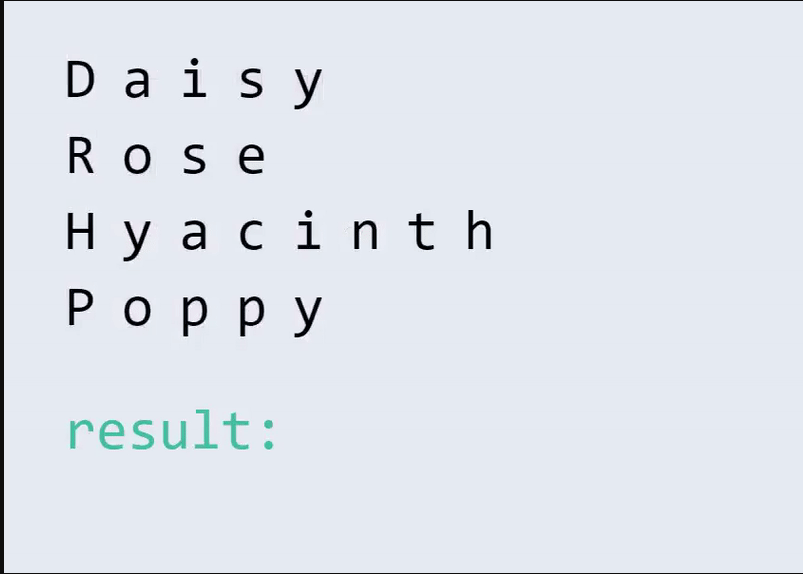

## Description
------

[Home](../README.md)

[Before](..) | [Next](..)

[Alt/rust](./Alt_rust/README.md) | [Alt/js](./Alt_js/README.html) | [Alt/py3](./Alt_py3/README.md) | [Alt/cpp](./Alt_cpp/README.md) | [Alt/c](./Alt_c/README.md)

You are given an array of strings `arr`. Your task is to construct a string from the words in `arr`, starting with the `0th` character from each word (in the order they appear in `arr`), followed by the `1st` character, then the `2nd` character, etc. If one of the words doesn't have an `ith` character, skip that word.

Return the resulting string.

**Example**

-   For `arr = ["Daisy", "Rose", "Hyacinth", "Poppy"]`, the output should be `solution(arr) = "DRHPaoyoisapsecpyiynth"`.

-   First, we append all 0th characters and obtain string "DRHP";
-   Then we append all 1st characters and obtain string "DRHPaoyo";
-   Then we append all 2nd characters and obtain string "DRHPaoyoisap";
-   Then we append all 3rd characters and obtain string "DRHPaoyoisapaecp";
-   Then we append all 4th characters and obtain string "DRHPaoyoisapaecpyiy";
-   Finally, only letters in the arr[2] are left, so we append the rest characters and get "DRHPaoyoisapaecpyiynth";

 

-   For `arr = ["E", "M", "I", "L", "Y"]`, the output should be `solution(arr) = "EMILY"`.

    Since each of these strings have only one character, the answer will be concatenation of each string in order, so the answer is EMILY.

**Input/Output**

* **[execution time limit] 4 seconds (js)**

* **[input] array.string arr**

    An array of strings containing alphanumeric characters.

    *Guaranteed constraints:*

        1 ≤ arr.length ≤ 100
        1 ≤ arr[i].length ≤ 100

* **[output] string**

    Output string

**[JavaScript (ES6)] Syntax Tips**


// Prints help message to the console
// Returns a string
function helloWorld(name) {
    console.log("This prints to the console when you Run Tests");
    return "Hello, " + name;
}


## Solution
------







