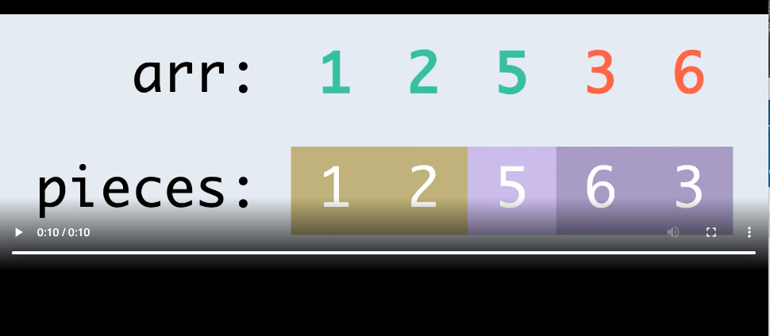

## Description
------

[Home](../README.md)

[Before](../220420_Task_3/README.md) | [Next](..)

[Alt/rust](./Alt_rust/README.md) | [Alt/js](./Alt_js/README.html) | [Alt/py3](./Alt_py3/README.md) | [Alt/cpp](./Alt_cpp/README.md) | [Alt/c](./Alt_c/README.md)

Your task to check whether it is possible to construct a given array of integers from a bunch of given pieces.

More formally, you are given an array of distinct non-negative integers `arr` and an array of integer arrays `pieces`. Your task is to check whether it is possible to arrange the arrays of `pieces` in such a way that they can be concatenated to form an array equal to `arr` (containing all the same elements in the same order).

**Example**

-   For `arr = [1, 2, 5, 3]` and `pieces = [[5], [1, 2], [3]]`, the output should be `solution(arr, pieces) = true`.

    The arrays of `pieces` can be arranged in the order `[1, 2]`, `[5]`, and `[3]`, which would be equal to `arr = [1, 2, 5, 3]` when concatenated.

-   For `arr = [1, 2, 5, 3, 6]` and `pieces = [[1, 2], [5], [6, 3]]`, the output should be `solution(arr, pieces) = false`.

    Expand to see the example video.

    

 

    There are no arrangements of `pieces` that would result in an array equal to `arr`.

-   For `arr = [1, 5, 4, 3, 2, 8]` and `pieces = [[4, 3], [1, 5], [2]]`, the output should be `solution(arr, pieces) = false`.

    Since the sum of the lengths of the arrays of `pieces` isn't equal to the length of `arr`, there's no way they could become equal, so the answer is `false`.

-   For `arr = [1, 5, 4, 3, 2, 8]` and `pieces = [[1, 5, 5], [3, 2], [8]]`, the output should be `solution(arr, pieces) = false`.

    Since the elements of `arr` aren't equal to the elements of the arrays of `pieces`, there's no way they could become equal, so the answer is `false`.

**Input/Output**

* **[execution time limit] 4 seconds (js)**

* **[input] array.integer arr**

    An array of pairwise distinct non-negative integers.

    *Guaranteed constraints:*

    <code type='math/tex'> 1 \leq arr.length \leq 10^5</code>.
    
    <code type='math/tex'> 0 \leq arr[i] \leq 10^9</code>. 

* **[input] array.array.integer pieces**

    An array of arrays of non-negative integers. The total count of integers in pieces doesn't exceed 105.

    *Guaranteed constraints:*

    
    <code type='math/tex'> 1 \leq pieces.length \leq 10^5</code>.
    
    <code type='math/tex'> 1 \leq pieces[i].length \leq 10^5</code>.
    
    <code type='math/tex'> 0 \leq pieces[i][j] \leq 10^9</code>. 

* **[output] boolean**

    Return true if it's possible to rearrange the arrays of pieces and concatenate them, such that the resulting array is equal to arr, otherwise return false.

**[JavaScript (ES6)] Syntax Tips**


// Prints help message to the console
// Returns a string
function helloWorld(name) {
    console.log("This prints to the console when you Run Tests");
    return "Hello, " + name;
}


## Solution
------







